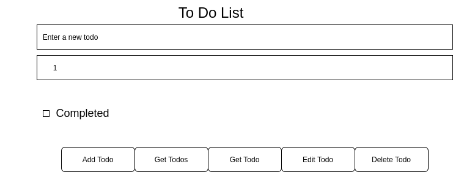

# To Do List Asynchronously

- This is a refactoring for the to do list earlier project.
- The project has been developed using classes, fetch and async / await.
- It stores data in a json format file.

---

## User Story Dependencies

[Story Dependency Diagram](https://excalidraw.com/)

---

## WIREFRAME

---

## 0.Setup

**A User can see my initial repository and live demo**

### Repository

- Fork [boilerplate repository](https://github.com/HackYourFutureBelgium/restful-pjs) repository
- Clone the repository
- Add a wireframe
- Start the development strategy
- Write initial, basic README
- Push the changes to GitHub
- Turn on GitHub Page
- Put reference to the project in the my personal issue

---

## 1. Initialize Application

__As a user I want to see the initial page when I load the site__

- A user can see the initial page.

### REPO

- This user story is developed on branch `init`.
- This branch is merged to `master` branch after completion.

### HTML

- Add input text, checkbox and four buttons

### CSS

- Add some styling

### Assets

- Add assets directory
- Add references to external resources

---

## 2. Add To Do

__As a user I want to be able to add todos__

- __When the user type text in the input text box and click on add to do button a to do will be added to the list__

### REPO

- This user story is developed on branch `add-todo`.
- This branch is merged to `master` branch after completion.

### HTML

### CSS

### JS

#### Listener

#### Handler

---

## 3. Get All Todos

__As a user I want to be able to retrieve all todos__

- __When the user click on get todos button all todos will be shown to the user__

### REPO

- This user story is developed on branch `get-all-todos`.
- This branch is merged to `master` branch after completion.

### HTML

### CSS

### JS

#### Listener

#### Handler

---

## 4. Get One Todo

__As a user I want to be able to retrieve a specifiec todo__

- __When the user click on get a todo button that todo will be shown to the user__

### REPO

- This user story is developed on branch `get-one-todo`.
- This branch is merged to `master` branch after completion.

### HTML

### CSS

### JS

#### Listener

#### Handler

---

## 5. Edit To Do

__As a user I want to be able to update a specific todo__

- __When the user click on edit todo button that todo will be updated__

### REPO

- This user story is developed on branch `edit-todo`.
- This branch is merged to `master` branch after completion.

### HTML

### CSS

### JS

#### Listener

#### Handler

---

## 6. Delete To Do

__As a user I want to be to able delete a specific todo from the list__

- __When the user click on delete todo button this todo will be removed__

### REPO

- This user story is developed on branch `delete-todo`.
- This branch is merged to `master` branch after completion.

### HTML

### CSS

### JS

#### Listener

#### Handler

